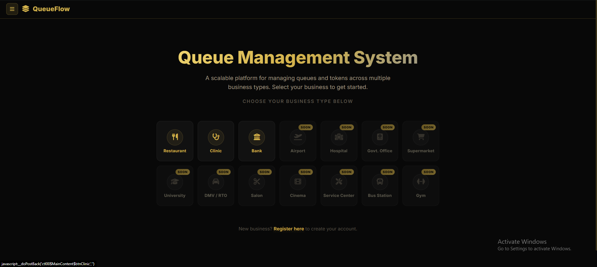
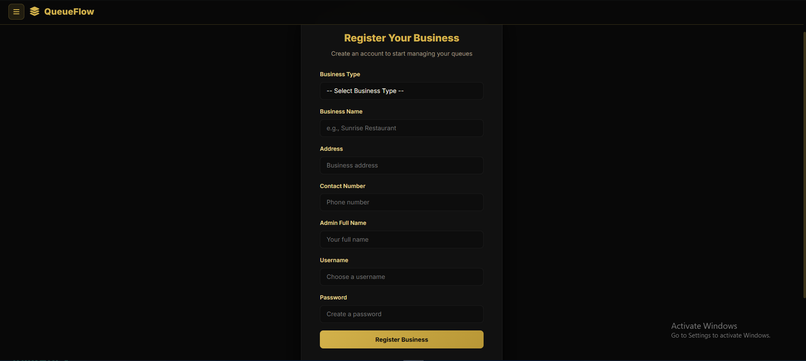
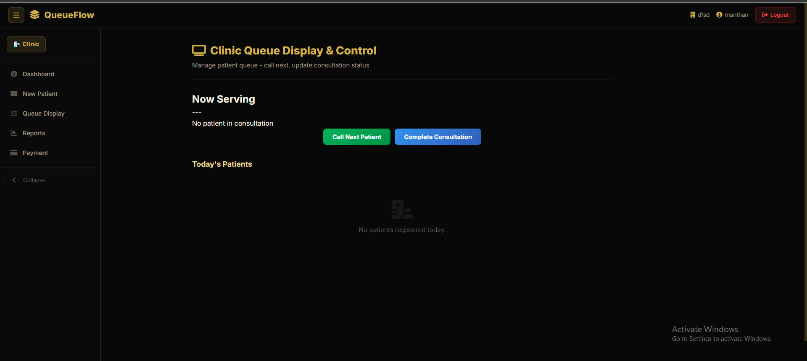

# QueueFlow - Scalable Queue Management System

QueueFlow is a comprehensive, scalable platform designed to manage queues and tokens across multiple business types. By digitizing the waiting experience, QueueFlow eliminates the chaos of physical queues, streamlines operations, and significantly improves customer satisfaction.

## 🚀 The Necessity of QueueFlow

In today's fast-paced world, long waiting times and crowded reception areas are major pain points for both businesses and customers. Traditional queue management relies on physical tokens or unorganized waiting lines, which often lead to:
- Overcrowded waiting areas.
- Customer frustration and walk-outs.
- Inefficient staff allocation and time management.

**QueueFlow solves this by providing:**
- **Real-time Queue Tracking:** Customers can track their queue status dynamically.
- **Unified Platform:** One central system capable of handling various business models (clinics, restaurants, cinemas, etc.).
- **Data-Driven Insights:** Businesses can view total visitors, currently waiting, and completed services at a glance.

## 🏢 Business Dashboards Offered

QueueFlow offers specialized dashboards tailored to the unique workflows of different businesses. Our primary modules currently include:

### 1. Clinic Dashboard 🩺
Tailored for healthcare facilities to manage patient flow efficiently. 
- **Features:** Track patients with metrics like *Total Patients Today*, *Waiting*, *In Consultation*, and *Completed*.
- **Benefit:** Allows receptionists and doctors to seamlessly call the next patient, ensuring a calm and organized waiting room.

### 2. Restaurant Dashboard 🍽️
Designed for dining establishments to manage table reservations and walk-in waiting lists.
- **Features:** Assign tokens to groups, notify them when their table is ready, and manage table turnover rates.
- **Benefit:** Prevents crowding at the entrance and gives diners the freedom to wait comfortably elsewhere.

### 3. Movie / Cinema Dashboard 🍿
Manages ticketing queues and theater entry flows.
- **Features:** Streamline box-office queues and coordinate audience entry for different screen timings.
- **Benefit:** Ensures a smooth, bottleneck-free experience for movie-goers right before Showtime.

*(Note: The platform is built to be highly scalable, with future support planned for Banks, Airports, Supermarkets, and more.)*

## 📸 Gallery

### Business Selection & Hub
A clean, centralized hub where users can select their specific business type to enter their dedicated workspace.

### Business Registration
A seamless onboarding process for new businesses to register and start managing their queues instantly.

### Clinic Dashboard Example
An intuitive, dark-themed dashboard providing an immediate overview of the queue status.

## 🛠️ Tech Stack

- **Framework:** ASP.NET Web Forms (.NET Framework 4.7.2)
- **Database:** SQLite (Self-contained, no heavy SQL Server required)
- **Frontend:** HTML, CSS, JavaScript (Custom Dark Theme UI)
- **Architecture:** Monolithic with modular business routing

## 🚦 How to Run Locally

1. Clone the repository.
2. Open `QueueManagementSystem.slnx` or `.csproj` in **Visual Studio 2019/2022**.
3. Ensure the **ASP.NET and web development** workload is installed.
4. Set the launch profile to **IIS Express**.
5. Press `F5` to build and run the application.

*The SQLite database is included in the `App_Data` folder and requires no additional setup.*

## 🔒 Security & Privacy
This repository is stripped of all sensitive API keys and personal environment variables, making it safe for public deployment and open-source contribution.
